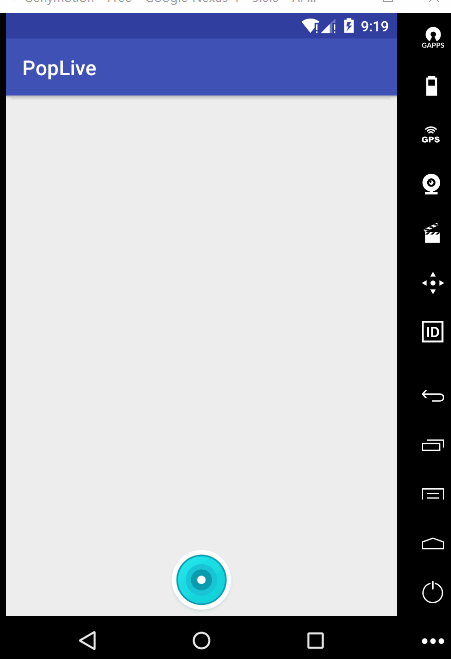

# 仿映客发布直播  
先上效果图   

## 显示进入动画效果  

    //遍历根试图下的一级子试图
        for (int i = 0; i < layout.getChildCount(); i++) {
            final View child = layout.getChildAt(i);
            //设置所有一级子试图的点击事件
            child.setOnClickListener(this);
            child.setVisibility(View.INVISIBLE);
            //延迟显示每个子试图(主要动画就体现在这里)
            Observable.timer(i * 50, TimeUnit.MILLISECONDS)
                    .subscribeOn(Schedulers.newThread())
                    .observeOn(AndroidSchedulers.mainThread())
                    .subscribe(aLong -> {
                        child.setVisibility(View.VISIBLE);
                        ValueAnimator fadeAnim = ObjectAnimator.ofFloat(child, "translationY", 600, 0);
                        fadeAnim.setDuration(300);
                        KickBackAnimator kickAnimator = new KickBackAnimator();
                        kickAnimator.setDuration(150);
                        fadeAnim.setEvaluator(kickAnimator);
                        fadeAnim.start();
                    });
        }
        
     ## 关闭动画效果  
     
     for (int i = 0; i < layout.getChildCount(); i++) {
            final View child = layout.getChildAt(i);
            Observable.timer((layout.getChildCount() - i - 1) * 30, TimeUnit.MILLISECONDS)
                    .subscribeOn(Schedulers.newThread())
                    .observeOn(AndroidSchedulers.mainThread())
                    .subscribe(aLong -> {
                        child.setVisibility(View.VISIBLE);
                        ValueAnimator fadeAnim = ObjectAnimator.ofFloat(child, "translationY", 0, 600);
                        fadeAnim.setDuration(100);
                        KickBackAnimator kickAnimator = new KickBackAnimator();
                        kickAnimator.setDuration(100);
                        fadeAnim.setEvaluator(kickAnimator);
                        fadeAnim.start();
                        fadeAnim.addListener(new Animator.AnimatorListener() {

                            @Override
                            public void onAnimationStart(Animator animation) {
                            }

                            @Override
                            public void onAnimationRepeat(Animator animation) {
                            }

                            @Override
                            public void onAnimationEnd(Animator animation) {
                                child.setVisibility(View.INVISIBLE);

                            }

                            @Override
                            public void onAnimationCancel(Animator animation) {
                            }
                        });
                    });
            Observable.timer((layout.getChildCount() - i) * 30 + 80, TimeUnit.MILLISECONDS)
                    .subscribeOn(Schedulers.newThread())
                    .observeOn(AndroidSchedulers.mainThread())
                    .subscribe(aLong -> dismiss());
        }

